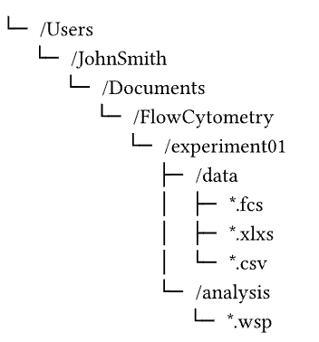

# Recommendations for Flow Cytometry Data Storage and Analysis
## About Flow Cytometry Data
Data generated by conventional or spectral flow cytometers are stored in the specified format of a FCS file. These files vary in size depending on the number of cells analysed, size of the panel and acquisition settings of the cytometer, resulting in data that ranges from several Megabytes (MB) to over 10 Gigabytes (GB) for a single sample. Then taking into consideration that each experiement/cohort contains several samples across multiple timepoints, the overall size of each experimental dataset increases at an exponential scale. This data is analysed using a combination of SpectroFlo/Flowjo/OMIQ/Cytobank, to determine compensation, gating strategies, cell proportions and other statistics.

## Data Transfer and Storage
Currently flow cytometry data is exported on to the local computer attached to the cytometer, before being transferred by the user to an alternative location (i.e. Stornext). This transfer maybe facilitated using GP_transfer/Handover or via a network connection to Stornext/VAST. VAST is currently recommended as the location for storage of any data used in an active project, and long-term archival and back-up of files to be located on Stornext.

> **_NOTE:_** It is recommended that researchers use [Handover](https://wehieduau.sharepoint.com/sites/rc2/SitePages/HandOver-Data-Sharing.aspx) to transfer their data. As it provides additional data security by ensuring that only the named researchers are able to access the folder.

## NAS Storage and FlowJo: _What is a NAS and why does the storage location matter so much for Flowjo?_
A NAS is a **Network Attached Storage**. Similar to a hard drive, a NAS provides additional storage which can be viewed through finder/file explorer. However, as implied in the name, a NAS uses a network connection (such as WEHI_staff WiFi) to connect your computer to the storage drive. Due to the use of a network connection, any disruptions to the network will break your connection to the storage and lead to file corruption.

Hence, analysis via Flowjo which is a local laptop/desktop only software, should **_never_**
 be performed directly on files stored on a NAS file system. These files should be downloaded on to the computer on which analysis is occurring. Upon completion of analysis, the Flowjo workspace file and exported output tables should be uploaded to the appropriate VAST project folder and backed-up onto Stornext, if appropriate.

 > **Note**: Milton, the WEHI HPC, does _not_ use a network based connection to VAST/Stornext and as such analysis run on the HPC may occur directly on files in those locations
 
### Keeping Flowjo Workspaces connected to your data
> Help! I opened my Flowjo Workspace file and it's saying it can't find my data

Researchers may be familiar with the window pop-up in Flowjo, where Flowjo indicates that it can't find the FCS files associated with the workspace. Typically, this warning occurs after moving either the workspace file (`.wsp`/`.flowjo`) or the FCS files into other folders or locations. This is because Flowjo doesn't retain a copy of your data in it's workspace, instead Flowjo records a "relative path" from the location of the workspace file and the data.

Taking the example folder structure below:

Flowjo will use the workspace (`.wsp` ) file as the anchor for describing where the data is. In this case, the data could be described as "from the location of the workspace file, we go back one folder level and locate the 'data' folder". As such, retaining and mirroring this folder structure as you move around the workspace/data files, will ensure that Flowjo is able to find the associated data .

## Cloud-based analysis software (OMIQ/Cytobank): _Where can my data be stored long-term?_

> **Policy Note**: If you are using any cloud platforms, you must fill in the [WEHI Cloud Usage Form](https://forms.monday.com/forms/29cbac9efec6ff0e9b3cc2e6437ac5fa?r=apse2) to ensure that ITS & RCP are aware of the platforms in use.

Cloud based analysis software has rapidly become popular for flow cytometry analysis, with OMIQ and Cytobank as the primary contenders. Due to the cloud based nature of these softwares, data must be uploaded to the appropriate cloud servers to be analysed with their analysis software. For data that is located on a NAS storage device, the data should be downloaded to your local computer and from the local copy to the cloud service. This intermediate storage of data on your local computer minimises the risk of data corruption, due to the network disruptions.

Similar to analysis with Flowjo, it is strongly recommended that upon completion of analysis, the workspace file and any output tables are downloaded from the cloud service and uploaded to VAST projects, with an archival copy provided to Stornext. Long term storage of your data or analysis on cloud servers is _not recommended_.
